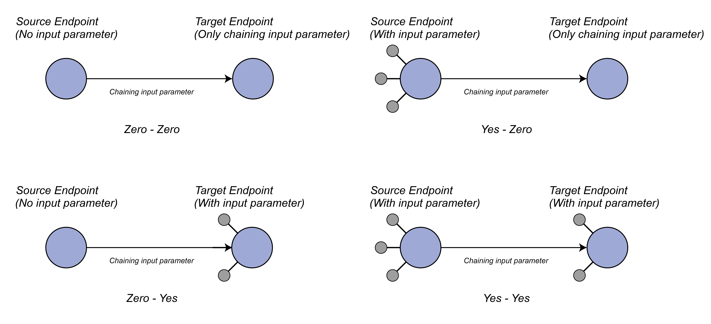

# ToolDial: Multi-turn Dialogue Generation Method for Tool-Augmented Language Models

ToolDial is a method that generates multi-turn dialogue data between a user and a tool-augmented language model based on GPT, utilizing an API graph.
We release the code for the API graph-based multi-turn dialogue generation method devised in the ToolDial work. We provide the API graph construction, dialogue data generation, and the evaluation codes used in the experiments. Additionally, we release all the datasets used in the experiments.

# 0. Environment Setting

Create new conda environment and install packages.

```
conda create -n tooldial python=3.11 ## We encourage you to set python version in 3.11
conda activate tooldial
pip install torch==2.4.0 torchvision==0.19.0 torchaudio==2.4.0 --index-url https://download.pytorch.org/whl/cu118

pip install -r requirements.txt
```

# 1. Graph Construction

In this stage, we will construct API Graph.

We provide large files through our Google Drive:
https://drive.google.com/drive/folders/1txuVDgUQw1rDA1ChoUGC4-FuYAOxD0S9?hl=ko

**1. Download all three files in `graph_construction` and place it in the base directory (ToolDial folder).**

**2. Run the below script**
```
python graph_generation.py ${LCS} ${keyword_similarity} ${description_similarity}
```
LCS, keyword_similarity, description_similarity stands for threshold of each criteria.

For example, if you want to use LCS:0.83, keyword_similarity:0.5, description_similarity:0.77 **(this is the threshold used in our work)**, you should run the following:

```
python graph_generation.py 0.83 0.5 0.77
```

# 2. Graph Evaluation (Removing invalid edges)

In this stage, we filter all invalid edges from previously constructed API graph.

In our work, we performed many tasks using tmux across multiple sessions in parallel.

**0. Move the directory**
```
cd graph_evaluation
```

**1. Open the Stable ToolBench server**

- 1.1 First, insert your openai API key in `graph_evaluation/config.yml`

- 1.2 Then run the below script

```
python server/main.py
```

or 

```
tmux new-session -d -s "server" "python server/main.py"
```

We encourage you to use **tmux sesseion**, because if the stable toolbench server is run in a regular terminal, a new terminal must be opened to execute other code.

**2. Graph Edge Evaluation**

After you open the StableToolBench Server, initiate the python code and bash script sequentially.

```
python stable_graph_metric/grapheval/file_split.py 20 083_05_077
./start_tmux.sh 20 083_05_077
```

After all 20 session is finished, run

```
python stable_graph_metric/grapheval/file_merge.py 20 083_05_077
python stable_graph_metric/grapheval/edge2pair.py 083_05_077
```

The values provided as arguments are examples. `20` represents the number of tmux sessions, and the specified number of sessions will be created to enable parallel processing.
`083_05_077` is the threshold provided during Graph Construction.

**Caution about arg**
- When inputting, it must be provided in a format where decimal points are removed and concatenated with _.
- When inputting values like 0.5 or 0.6, they must be entered as **05 or 06.** Entering them as 050 or 060 may result in an error.
- When running the four scripts for Graph Edge Evaluation, the number of tmux sessions and the threshold initially provided must remain consistent, as shown in the example above.

If you used other threshold, you may change the input threshold `083_05_077` to other value (074_06_054 etc).

Once the evaluation is done, make sure to turn off the StableToolBench server with

```
Ctrl-C ## If you turn on the server with python server/main.py
```

or

```
tmux kill-session -t server ## If you turn on the server with tmux
```

# 3. Dialogue Generation (Scenario Instruction Generation + Dialogue Generation)

First, switch the directory with 

```
cd ../dialogue_generation
```


If you have completed up to step 2, the `data_generation/pair_list` should contain the following 8 files:

```
aug_desc.json
all_edge_list_graph.json
normal_graph2idx.json
normal_idx2igraph.json
normal_idx2igraph.json
normal_graph.npy
pair_list.json
pair_list_original.json
```

The `pair_list.json` file contains valid edges created through **Graph Construction** and **Graph Evaluation.** In step **Dialogue Generation**, conversation data will be generated using `pair_list.json`.

We also release `pair_list_original.json` includes the edges we used when creating the previously distributed dialogue data.

Currently, in the third line of `pair_split.py`, the script is set to load the `pair_list_original.json` file. If you want to create dialogue data using the edges you created, replace `pair_list_original.json` with `pair_list.json` in `pair_split.py` and then execute the code.

The code for Dialogue Data generation also can executed using parallel processing through tmux.

First, fill the "api_key" in `config.yml` in `dialogue_generation` with your openai api key.

```
api_key: <Your API Key>
device: "cuda"
is_sampling: True

## ----------Very Important-------------
## Default value of 'is_sampling' is True, which only generates the dialogue with sampled edges.
## If you set it False, whole edges will be used and it will cost you about $2,500~$3,000.
## ----------Very Important-------------
```

Then, run the below script in order

```
python pair_split.py {n_tmux_session_for_split}
# As the number of splits increases, GPU memory usage rises sharply in later stages. A split of 4 to 5 is recommended.

./start_tmux.sh {n_tmux_session_for_split} {category} 
cd {category}
./start_tmux.sh {n_tmux_session_for_split} {category}
python dial_post.py {n_tmux_session_for_split} {category}
```

We have categorized the edges into four types



Dialogue generation code is executed differently depending on each edge type.

Fill in {category} with one of yesyes, yeszero, zeroyes, or zerozero, and execute the above code.
Set {n_tmux_session_for_split} to the same number used when running pair_split.py.

After running the script for all categories, you will see below four json files in `dialogue_generation` directory

```
sample_dialogue_yesyes.json
sample_dialogue_yeszero.json
sample_dialogue_zeroyes.json
sample_dialogue_zerozero.json
```

Next, merge all category's dialogues

```
cd ..
python merge_cat.py
```

And if file `total_dialogue.json` is in the current directory (dialogue_generation), the dialogue data has been completed!


# 4. Experiments

**1. Dataset Download**
   
First, we need to download the dataset. Change your directory into `dialogue_data`

```
cd ../dialogue_data
```

We release the data used in our experiments in our Google Drive.
https://drive.google.com/drive/folders/1txuVDgUQw1rDA1ChoUGC4-FuYAOxD0S9?hl=ko

Download all 9 json files in `dataset` into `dialogue_data`.

`train.json`, `val.json`, `test.json` is the base file.

`train_dialogue.json`, `val_dialogue.json`, `test_dialogue.json` is the dialogue which is used to evaluate "DST", "Action Prediction", "Faithfulness".

`train_dialogue_overall_obs.json`, `val_dialogue_overall_obs.json`, `test_dialogue_overall_obs.json` is the dialogue which is used to evaluate "Overall Performance".

We also provide two conversion code.

`dialogue_preprocess.py` is used to generate `train_dialogue.json`, `val_dialogue.json`, `test_dialogue.json`

and

`dialogue_generation_overall.py` is used to generate `train_dialogue_overall_obs.json`, `val_dialogue_overall_obs.json`, `test_dialogue_overall_obs.json`

All experiments were conducted using testset.

<br><br>

**2. Initiate Experiment with the dataset**

To run the experiment, change the directory with

```
cd ../experiments # from ToolDial/dialogue_data to ToolDial/experiments
```

<br>

2-0. Hardware settings

We used PyTorch's Distributed Data Parallel (DDP) for training and inference of the open-source model.

If you see the `run_train.sh`,

```
#!/bin/bash

export MASTER_ADDR=localhost
export MASTER_PORT=29500  # You can change the port number if needed

CUDA_VISIBLE_DEVICES=0,1,2,3 python {experiment_script}.py
```

`CUDA_VISIBLE_DEVICES`: Specify the GPUs to be used for training and inference. It is also possible to use only a single GPU.

`experiment_script`: Name of the script to run for the experiment. Script for each experiment is as follows:
- DST: dst_train_dist_normal
- Action Prediction: action_train_dist_normal
- Faithfulness: hall_train_dist_normal
- Overall Performance: overall_train_dist_normal

Fill `CUDA_VISIBLE_DEVICES` and `experiment_script` and run `run_train.sh`.

Before executing run_train.sh, I will review the arguments for each evaluation task code.

<br>

2-1. Dialogue State Tracking (DST)

1. Select the GPU and fill CUDA_VISIBLE_DEVICES
2. Fill the experiment_script with "dst_train_dist_normal"

3. Check the arguments of "dst_train.yaml"
- `train_file`, `test_file`: The dataset to be used for the experiments is currently set to use the data we have released.
- `model_id`: The name of the open-source model to be used. It should be entered in the format `{repo}/{model_name}` as provided by HuggingFace.
- `is_van`: `True` or `False`. If `True`, training is skipped, and inference is performed directly using the model specified in `model_id`.
- `is_give_label`: `True` or `False`. If `True`, the experiment is conducted in the "With GT" setting; if False, it is conducted in the "W/O GT" setting.
4. Run `./run_train.sh`. We encourage you to use tmux with

```
tmux new-session -d -s "dst_train" "./run_train.sh"
```

5. Once the code execution is complete, the experimental results are stored under `dst_result/{model_name}/{withgt or wogt}`, divided by the number of GPUs used. 

6. To view the experimental results and error analysis:

Navigate to the `dst_result` directory:

```
cd dst_result
```

Then, configure the `dst_error_analysis.yml` file with the appropriate values for model_name (only the `model_name` from `{repo}/{model_name}`), for example, if the model was `meta-llama/Meta-Llama-3-8B-Instruct`, then model name will be `Meta-Llama-3-8B-Instruct`, and is_give_label (`True` or `False`).

Finally, run the

```
python dst_error_analysis.py
```

This will provide the experimental results and error analysis based on the arguments set in `dst_error_analysis.yml`.

<br>

2-2. Action Prediction

1. Select the GPU and fill CUDA_VISIBLE_DEVICES
2. Fill the experiment_script with "action_train_dist_normal"

3. Check the arguments of "action_train.yaml"
- `train_file`, `test_file`: The dataset to be used for the experiments is currently set to use the data we have released.
- `model_id`: The name of the open-source model to be used. It should be entered in the format `{repo}/{model_name}` as provided by HuggingFace.
- `is_van`: `True` or `False`. If `True`, training is skipped, and inference is performed directly using the model specified in `model_id`.
- `is_give_label`: `True` or `False`. If `True`, the experiment is conducted in the "With GT" setting; if False, it is conducted in the "W/O GT" setting.
4. Run `./run_train.sh`. We encourage you to use tmux with

```
tmux new-session -d -s "action_train" "./run_train.sh"
```

5. Once the code execution is complete, the experimental results are stored under `action_prediction_result/{model_name}/{withgt or wogt}`, divided by the number of GPUs used. 

6. To view the experimental results and error analysis:

Navigate to the `action_prediction_result` directory:

```
cd action_prediction_result
```

Then, configure the `action_error_analysis.yml` file with the appropriate values for model_name (only the `model_name` from `{repo}/{model_name}`) and is_give_label (`True` or `False`).

Finally, run the 

```
python action_error_analysis.py
```

This will provide the experimental results and error analysis based on the arguments set in `action_error_analysis.yml`.

<br>

2-3. Faithfulness

1. Select the GPU and fill CUDA_VISIBLE_DEVICES
2. Fill the experiment_script with "hall_train_dist_normal"

3. Check the arguments of "hall_train.yaml"
- `train_file`, `test_file`: The dataset to be used for the experiments is currently set to use the data we have released.
- `model_id`: The name of the open-source model to be used. It should be entered in the format `{repo}/{model_name}` as provided by HuggingFace.
- `api_key`:  Your openai API key
- `is_van`: `True` or `False`. If `True`, training is skipped, and inference is performed directly using the model specified in `model_id`.
4. Run `./run_train.sh`. We encourage you to use tmux with

```
tmux new-session -d -s "hall_train" "./run_train.sh"
```

5. Once the code execution is complete, the experimental results are stored under `faithfulness_result/{model_name}`, divided by the number of GPUs used. 

6. To view the experimental results and error analysis:

Navigate to the `faithfulness_result` directory:

```
cd faithfulness_result
```

Then, configure the `hall_result.yml` file with the appropriate values for model_name (only the `model_name` from `{repo}/{model_name}`).

Finally, run the 

```
python hall_result.py
```

This will provide the experimental resultsbased on the arguments set in `hall_result.yml`.

<br>

2-4. Overall Performance

1. Select the GPU and fill CUDA_VISIBLE_DEVICES
2. Fill the experiment_script with "overall_train_dist_normal"

3. Check the arguments of "overall_train.yaml"
- `train_file`, `test_file`: The dataset to be used for the experiments is currently set to use the data we have released.
- `model_id`: The name of the open-source model to be used. It should be entered in the format `{repo}/{model_name}` as provided by HuggingFace.
- `is_van`: `True` or `False`. If `True`, training is skipped, and inference is performed directly using the model specified in `model_id`.
4. Run `./run_train.sh`. We encourage you to use tmux with

```
tmux new-session -d -s "overall_train" "./run_train.sh"
```

5. Once the code execution is complete, the experimental results are stored under `overall_result/{model_name}`, divided by the number of GPUs used. 

6. To view the experimental results and error analysis:

Navigate to the `overall_result` directory:

```
cd overall_result
```

Then, configure the `overall_result.yml` file with the appropriate values for model_name (only the `model_name` from `{repo}/{model_name}`).

Finally, run the 

```
python overall_result.py
```


This will provide the experimental resultsbased on the arguments set in `overall_result.yml`.

<br>


2-5. GPT baslines inference results

We also release the inference results used to present the GPT baseline experiment results in our paper.

We also provide error analysis code for DST and Action Prediction.

Inside the `dst_result` and `action_prediction_result` folders, there is a `gpt_baselines` folder containing the inference results and error analysis code.

By filling in each `yml` file appropriately and running the error analysis code, you can view the experimental results and error analysis outcomes.

# Citation
```
@misc{shim2025tooldialmultiturndialoguegeneration,
      title={ToolDial: Multi-turn Dialogue Generation Method for Tool-Augmented Language Models}, 
      author={Jeonghoon Shim and Gyuhyeon Seo and Cheongsu Lim and Yohan Jo},
      year={2025},
      eprint={2503.00564},
      archivePrefix={arXiv},
      primaryClass={cs.CL},
      url={https://arxiv.org/abs/2503.00564}, 
}
```

